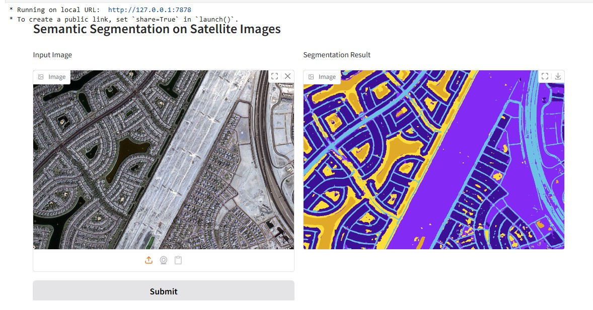

### Satellite Data with Deep Learning

##### Dataset: Semantic Segmentation of Aerial Imagery

The dataset can be downloaded from Kaggle 

##### Load Data

Use the `download_kaggle_data` function from the `kaggle_utils.loader` and load the data by providing the dataset name and the download folder path.

The dataset contains tiles (images) and relevant masks to classify the input images.

Make sure al the tiles and masks image size is the multiple of patch size, which will affect the batch size in data processing. Smaller patches --> large batch, and larger patches --> small batch.

We'll split our images and masks further to match our patch size.

One-hot enconding transformation is also applied to the labels.

##### Notebooks Overview

The `src` folder contains Jupyter notebooks that guide you through the end-to-end workflow:

- __load_dataset.py__ is used to load data from Kaggle link.
- __data_processing.ipynb__ demonstrates how to preprocess, and visualize the dataset. This includes patch extraction and one-hot encoding of masks.
- __model_training_prediction.ipynb__ Shows how to build and train a deep learning model (U-Net) for semantic segmentation using Tensorflow. Covers customized loss functions, and metrics.
- __prediction_deployment.ipynb__ Provides tools for evaluating model performance and visualizing predictions versus ground truth.

- __prediction_gradio.ipynb__ Explains how to perform inference on new aerial images using the trained model. Includes steps for loading saved weights, running predictions on unseen data. A gradio UI is created where we can load any image to predict the class labels (mask).

